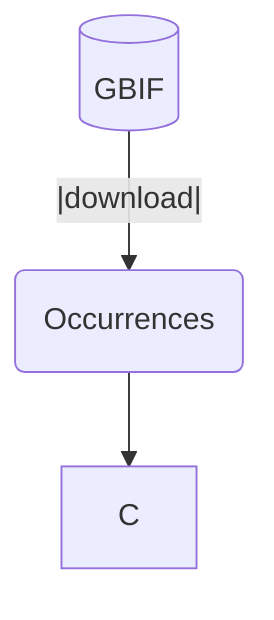

# Quetzal_on_OSG

iDDC modeling and inference using the Quetzal framework on Open Science Grid
for distributed High Throughput Computing.

## What problem does this project solve?

Running iDDC model inference is a heavy task. You need many different data,
many tools, a lot of computational fire power and a lot of scripting to glue all of this together.

That is not in the reach in many people interested in statistical phylogeography.

:gift: Here we use Open Science Grid, an awesome dHTC resource and we glue Quetzal tools (Quetzal-CoaTL,
Quetzal-CRUMBS, Quetzal-EGGS and Quetzal-NEST) together, so you can run
a spatially explicit inference more swiftly!

Hopefully it will make your life easier and your iDDC goals more reachable.

>  The [OSG](https://opensciencegrid.org/) is a consortium of research collaborations, campuses, national
> laboratories and software providers dedicated to the advancement of all open
> science via the practice of distributed High Throughput Computing (dHTC)

## The pipeline

D[(CHELSA)]--|download|-->E(babla);

## How to use it

### Replicating the example results

1. You need [an account on Open Science Grid](https://opensciencegrid.org/).
2. Then connect to your login node with e.g. `ssh user@login.osgconnect.net`
3. Clone this repository with `git clone https://github.com/Becheler/quetzal_on_OSG.git`
4. Enter the repo with `cd quetzal_on_OSG`
5. Initialize some symbolic links with `chmod u+x src/init.sh && ./src/init.sh`
6. Make an output directory and enter it: `mkdir output && cd output`
7. Run the example inference with 10 simulations, 2 repetitions in case of failure, and a SDM projected from the LGM (`-199`) to today (`20`):
     - `./../generate_DAG 10 2 $(seq -s ' ' -199 1 20) > flow.dag`
     - submit with `condor_submit_dag flow.dag`
     - assess the advancement with `condor_watch_q`
8. Once the simulations are done:
   - retrieve summary statistics: `sh src/post-analysis/get_sumstats.sh`
   - retrieve parameters table: `sh src/post-analysis/get_param_table.sh`
9. Use ABC-RF package (CRAN) to perform inference!

### Changing the user input

The following input files are defined by the user and should be placed in the `input_files` folder:

- `suitability.tif`: the suitability geotiff file for representing the landscape:
 - NA for representing ocean cells
 - 0 for representing continental cells of null suitability and infinite friction
 - ]0,1] values for intermediate suitability and frictions
- `EGG.conf`: configuration file for the quetzal-EGG used - unknown parameter values will be rewritten by the ABC pipeline
- `sample.csv`: file mapping sampled gene copies IDS to their latitude longitude sampling points
- `imap.txt`: IMAP file from BPP mapping individuals to putative populations for computing summary statistics

### Debugging

* Check progress of scheduled jobs with `condor_q` or `condor_watch_q`
* If a job fails, check `cat *out` to see if there is any executable path error.
* If a job is hold, something is wrong:
    - use `condor_q -nobatch` to get the ID of the job being on hold
    - use `condor_q -better-analyze <JOB-ID>` to check for bug reasons (generally wrong paths or files not found)
